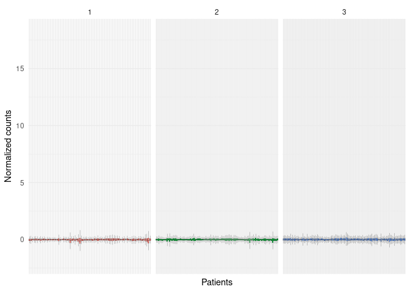
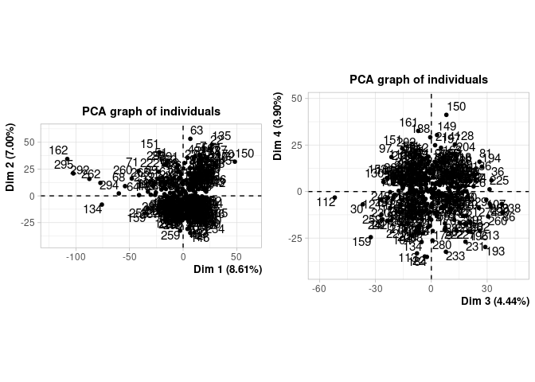
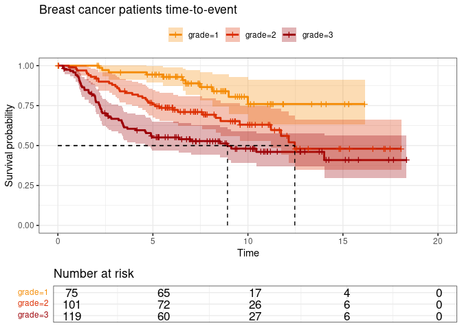
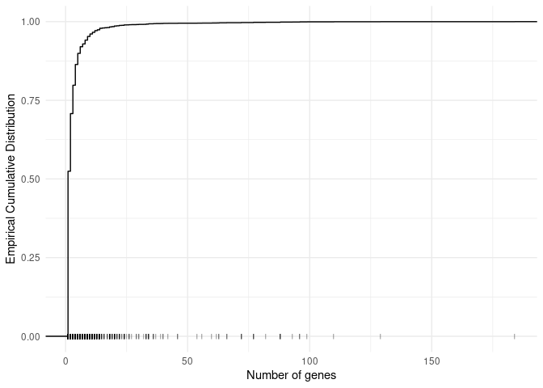
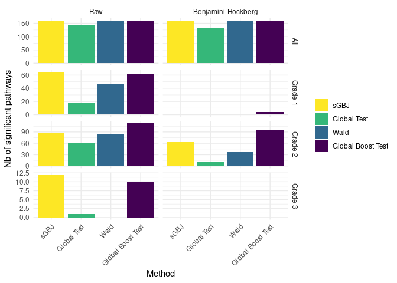
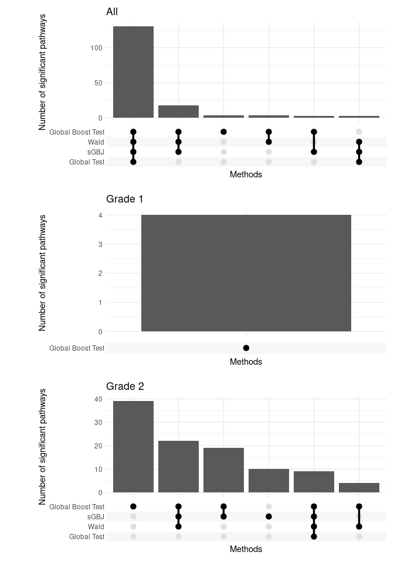
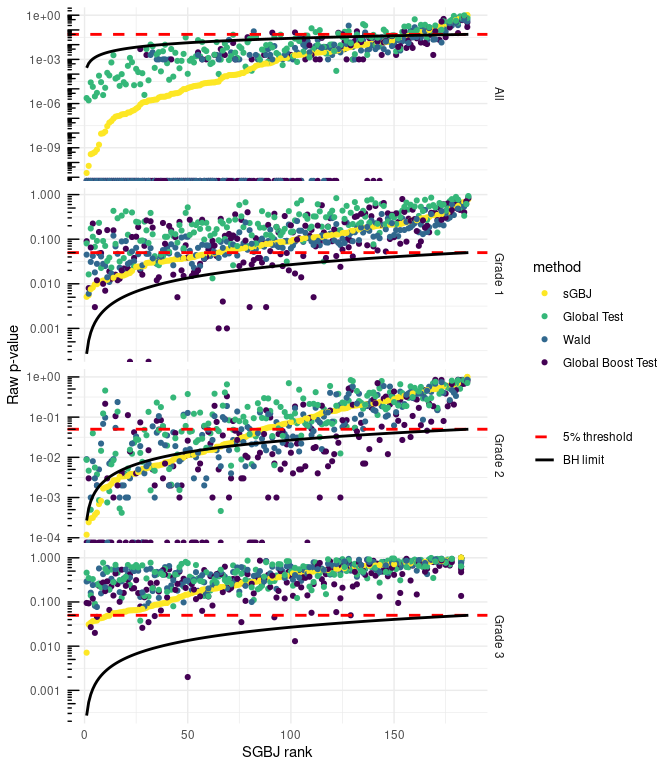

Breast cancer
================
TF

- [Describe Breast Cancer cohort](#describe-breast-cancer-cohort)
- [Breast cancer pathway analysis](#breast-cancer-pathway-analysis)
  - [Description of pathways](#description-of-pathways)
  - [Methods comparison](#methods-comparison)

# Describe Breast Cancer cohort

<table class="gt_table" data-quarto-disable-processing="false" data-quarto-bootstrap="false">
  <thead>
    <tr class="gt_col_headings">
      <th class="gt_col_heading gt_columns_bottom_border gt_left" rowspan="1" colspan="1" scope="col" id="label"><strong>Characteristic</strong></th>
      <th class="gt_col_heading gt_columns_bottom_border gt_center" rowspan="1" colspan="1" scope="col" id="stat_0"><strong>N = 295</strong>1</th>
    </tr>
  </thead>
  <tbody class="gt_table_body">
    <tr><td headers="label" class="gt_row gt_left">age</td>
<td headers="stat_0" class="gt_row gt_center">44 (40, 49)</td></tr>
    <tr><td headers="label" class="gt_row gt_left">event</td>
<td headers="stat_0" class="gt_row gt_center">106 (36%)</td></tr>
    <tr><td headers="label" class="gt_row gt_left">time</td>
<td headers="stat_0" class="gt_row gt_center">6.6 (3.4, 9.8)</td></tr>
    <tr><td headers="label" class="gt_row gt_left">grade</td>
<td headers="stat_0" class="gt_row gt_center"> </td></tr>
    <tr><td headers="label" class="gt_row gt_left">    1</td>
<td headers="stat_0" class="gt_row gt_center">75 (25%)</td></tr>
    <tr><td headers="label" class="gt_row gt_left">    2</td>
<td headers="stat_0" class="gt_row gt_center">101 (34%)</td></tr>
    <tr><td headers="label" class="gt_row gt_left">    3</td>
<td headers="stat_0" class="gt_row gt_center">119 (40%)</td></tr>
  </tbody>
  &#10;  <tfoot class="gt_footnotes">
    <tr>
      <td class="gt_footnote" colspan="2">1 Median (Q1, Q3); n (%)</td>
    </tr>
  </tfoot>
</table>

Figure 1: Breast cancer count per
patient per tumor type

Figure 2: First two PCA factorial
plans

Here are the kaplan meier curves for the two types of disease:

Figure 3: Kaplan meier curves for
Astro, Oligo

# Breast cancer pathway analysis

## Description of pathways

Figure 4: Empirical Cumulative Distribution
Function of number of genes by pathway. Breast cancer study.

## Methods comparison

Figure 5: Number of significant pathways by
method.

Figure 6: Upset plot of the
Benjamini-Hockberg p-value agreement according to the different methods

Figure 7: Raw
p-values in function of the ordered ranks of sGBJ for the 4 methods
(sGBJ , global boost test, Wald test and global test), with the 5%
threshold and the Benjamini Hochberg limit, computed for astrocytoma,
oligodendroglioma and all patients. Nota Bene: The Benjamini Hochberg
limit only applies for the sGBJ method, as the ranks are computed for
sGBJ only.

NB about GT test :
<https://www.bioconductor.org/packages/release/bioc/vignettes/globaltest/inst/doc/GlobalTest.pdf>
: “Because permutations require an exchangeable null hypothesis, such a
permutation p-value is only available for the linear model and for the
exchangeable null hypotheses ~1 and ~0 in other models.”
