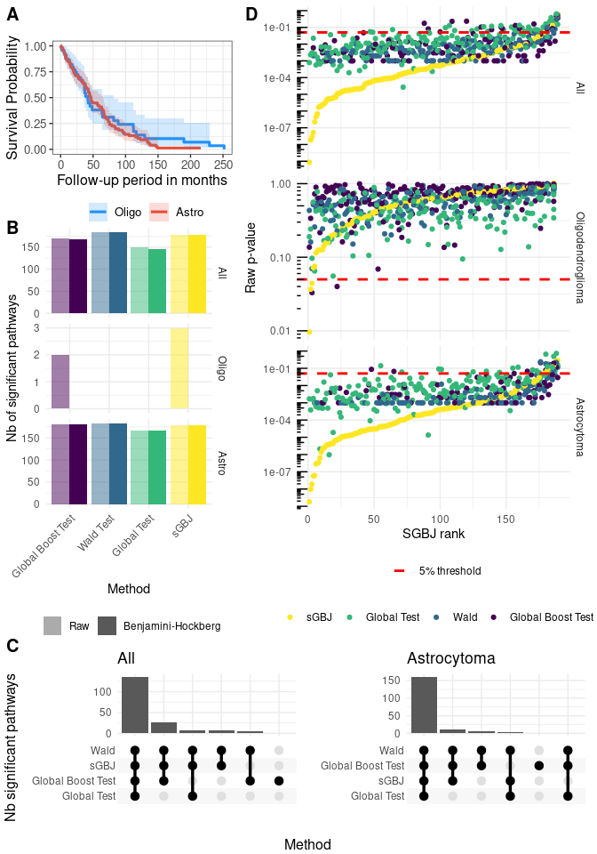

# Draft - sGBJ
TF

# Simulation study

## Simulation setting

- number of genes : $NG = \{10, 50\}$
- number of individuals : $N = \{50, 100\}$
- proportion of significant genes = $0.2$
- proportion of censored individuals : $c = 0.3$
- Variance : $C_{jj} = 0.2$

### Case

- Case (I) : Overall correlation follows a non-standard beta
  $corr \sim NSBeta(20, 20, min=-1, max =1)$
- Case (II) : Correlation between significant genes
  $corr \sim NSBeta(10, 10, min=-1, max =1)$ and between other genes
  $corr \sim NSBeta(25, 25, min=-1, max =1)$

**Note : Case IV and V are not guaranteed to generate positive definite
matrix, after the correlation values are sampled, if the matrix is not
positive definite, the nearest positive definite matrix is computed
using the algorithm defined by Higham 2002 (see Matrix::nearPD). This
correction was not implemented for scenario D, E and F.**

- Case (III) : Correlation between significant genes is $0.2$,
  correlation with non significant genes is $0$.

### Type

- Type (Z) : $\beta = 0$ evaluates the type-I error
- Type (A) : $\beta \sim \mathcal{N}(0, 0.4^2)$. Correlation matrix of
  $\beta$ is the same as correlation matrix of genes.
- Type (B) : half of genes follows $\beta \sim \mathcal{N}(-0.4, 0.2^2)$
  and half follows $\beta \sim \mathcal{N}(0.4, 0.2^2)$. Correlation
  matrix of $\beta$ is the same as correlation matrix of genes.
- Type (C) : half of genes follows $\beta \sim \mathcal{N}(-0.8, 0.4^2)$
  and half follows $\beta \sim \mathcal{N}(0.8, 0.4^2)$. Correlation
  matrix of $\beta$ is the same as correlation matrix of genes.

## Results of simulation study

# Applications

## Breast cancer

### Description

| **Characteristic**               | **N = 260**1 |
|----------------------------------|-------------------------|
| age                              | 45.0 (41.0, 49.0)       |
| event                            | 88 (34%)                |
| time                             | 7.0 (4.9, 10.1)         |
| grade                            |                         |
|     1                            | 70 (27%)                |
|     2                            | 91 (35%)                |
|     3                            | 99 (38%)                |
| 1 Median (IQR); n (%) |                         |

Here are the kaplan meier curves for the two types of disease:

### Breast cancer pathway analysis

Analysis of breast cancer pathway adjusted on age, overall and
stratified by grade.

<table class="gt_table">
  <thead class="gt_header">
    <tr>
      <td colspan="2" class="gt_heading gt_title gt_font_normal gt_bottom_border" style>Proportion of significant pathway by method and glioma</td>
    </tr>
    &#10;  </thead>
  <thead class="gt_col_headings">
    <tr>
      <th class="gt_col_heading gt_columns_bottom_border gt_center" rowspan="1" colspan="1" scope="col" id="method">method</th>
      <th class="gt_col_heading gt_columns_bottom_border gt_right" rowspan="1" colspan="1" scope="col" id="prop_sign">prop_sign</th>
    </tr>
  </thead>
  <tbody class="gt_table_body">
    <tr class="gt_group_heading_row">
      <th colspan="2" class="gt_group_heading" scope="colgroup" id="All">All</th>
    </tr>
    <tr class="gt_row_group_first"><td headers="All  method" class="gt_row gt_center">sGBJ</td>
<td headers="All  prop_sign" class="gt_row gt_right">0.708</td></tr>
    <tr><td headers="All  method" class="gt_row gt_center">Global Test</td>
<td headers="All  prop_sign" class="gt_row gt_right">0.605</td></tr>
    <tr><td headers="All  method" class="gt_row gt_center">Wald</td>
<td headers="All  prop_sign" class="gt_row gt_right">0.734</td></tr>
    <tr><td headers="All  method" class="gt_row gt_center">Global Boost Test</td>
<td headers="All  prop_sign" class="gt_row gt_right">0.258</td></tr>
    <tr class="gt_group_heading_row">
      <th colspan="2" class="gt_group_heading" scope="colgroup" id="Grade 1">Grade 1</th>
    </tr>
    <tr class="gt_row_group_first"><td headers="Grade 1  method" class="gt_row gt_center">sGBJ</td>
<td headers="Grade 1  prop_sign" class="gt_row gt_right">0.000</td></tr>
    <tr><td headers="Grade 1  method" class="gt_row gt_center">Global Test</td>
<td headers="Grade 1  prop_sign" class="gt_row gt_right">0.000</td></tr>
    <tr><td headers="Grade 1  method" class="gt_row gt_center">Wald</td>
<td headers="Grade 1  prop_sign" class="gt_row gt_right">0.061</td></tr>
    <tr><td headers="Grade 1  method" class="gt_row gt_center">Global Boost Test</td>
<td headers="Grade 1  prop_sign" class="gt_row gt_right">0.066</td></tr>
    <tr class="gt_group_heading_row">
      <th colspan="2" class="gt_group_heading" scope="colgroup" id="Grade 2">Grade 2</th>
    </tr>
    <tr class="gt_row_group_first"><td headers="Grade 2  method" class="gt_row gt_center">sGBJ</td>
<td headers="Grade 2  prop_sign" class="gt_row gt_right">0.088</td></tr>
    <tr><td headers="Grade 2  method" class="gt_row gt_center">Global Test</td>
<td headers="Grade 2  prop_sign" class="gt_row gt_right">0.011</td></tr>
    <tr><td headers="Grade 2  method" class="gt_row gt_center">Wald</td>
<td headers="Grade 2  prop_sign" class="gt_row gt_right">0.105</td></tr>
    <tr><td headers="Grade 2  method" class="gt_row gt_center">Global Boost Test</td>
<td headers="Grade 2  prop_sign" class="gt_row gt_right">0.046</td></tr>
    <tr class="gt_group_heading_row">
      <th colspan="2" class="gt_group_heading" scope="colgroup" id="Grade 3">Grade 3</th>
    </tr>
    <tr class="gt_row_group_first"><td headers="Grade 3  method" class="gt_row gt_center">sGBJ</td>
<td headers="Grade 3  prop_sign" class="gt_row gt_right">0.000</td></tr>
    <tr><td headers="Grade 3  method" class="gt_row gt_center">Global Test</td>
<td headers="Grade 3  prop_sign" class="gt_row gt_right">0.000</td></tr>
    <tr><td headers="Grade 3  method" class="gt_row gt_center">Wald</td>
<td headers="Grade 3  prop_sign" class="gt_row gt_right">0.000</td></tr>
    <tr><td headers="Grade 3  method" class="gt_row gt_center">Global Boost Test</td>
<td headers="Grade 3  prop_sign" class="gt_row gt_right">0.000</td></tr>
  </tbody>
  &#10;  
</table>

NB about GT test :
https://www.bioconductor.org/packages/release/bioc/vignettes/globaltest/inst/doc/GlobalTest.pdf
: “Because permutations require an exchangeable null hypothesis, such a
permutation p-value is only available for the linear model and for the
exchangeable null hypotheses ~1 and ~0 in other models.”

## Rembrandt

Analysis of rembrandt pathway adjusted on age and sex, overall and
stratified by tumor type.

### Describe Rembrandt cohort

| **Characteristic** | **ASTROCYTOMA**, N = 1081 | **OLIGODENDROGLIOMA**, N = 461 |
|----|----|----|
| Age |  |  |
|     \< 40 | 52 (48%) | 22 (48%) |
|     \>= 40 | 56 (52%) | 24 (52%) |
| Sex |  |  |
|     FEMALE | 37 (34%) | 23 (50%) |
|     MALE | 71 (66%) | 23 (50%) |
| Death | 85 (79%) | 34 (74%) |
| Follow-up period in months | 37 (15, 66) | 32 (16, 48) |
| 1 n (%); Median (IQR) |  |  |

Here are the kaplan meier curves for the two types of disease:

### Rembrandt pathway analysis

<table class="gt_table">
  <thead class="gt_header">
    <tr>
      <td colspan="2" class="gt_heading gt_title gt_font_normal gt_bottom_border" style>Proportion of significant pathway by method and glioma</td>
    </tr>
    &#10;  </thead>
  <thead class="gt_col_headings">
    <tr>
      <th class="gt_col_heading gt_columns_bottom_border gt_center" rowspan="1" colspan="1" scope="col" id="method">method</th>
      <th class="gt_col_heading gt_columns_bottom_border gt_right" rowspan="1" colspan="1" scope="col" id="prop_sign">prop_sign</th>
    </tr>
  </thead>
  <tbody class="gt_table_body">
    <tr class="gt_group_heading_row">
      <th colspan="2" class="gt_group_heading" scope="colgroup" id="All">All</th>
    </tr>
    <tr class="gt_row_group_first"><td headers="All  method" class="gt_row gt_center">sGBJ</td>
<td headers="All  prop_sign" class="gt_row gt_right">0.942</td></tr>
    <tr><td headers="All  method" class="gt_row gt_center">Global Test</td>
<td headers="All  prop_sign" class="gt_row gt_right">0.767</td></tr>
    <tr><td headers="All  method" class="gt_row gt_center">Wald</td>
<td headers="All  prop_sign" class="gt_row gt_right">0.968</td></tr>
    <tr><td headers="All  method" class="gt_row gt_center">Global Boost Test</td>
<td headers="All  prop_sign" class="gt_row gt_right">0.889</td></tr>
    <tr class="gt_group_heading_row">
      <th colspan="2" class="gt_group_heading" scope="colgroup" id="Oligodendroglioma">Oligodendroglioma</th>
    </tr>
    <tr class="gt_row_group_first"><td headers="Oligodendroglioma  method" class="gt_row gt_center">sGBJ</td>
<td headers="Oligodendroglioma  prop_sign" class="gt_row gt_right">0.000</td></tr>
    <tr><td headers="Oligodendroglioma  method" class="gt_row gt_center">Global Test</td>
<td headers="Oligodendroglioma  prop_sign" class="gt_row gt_right">0.000</td></tr>
    <tr><td headers="Oligodendroglioma  method" class="gt_row gt_center">Wald</td>
<td headers="Oligodendroglioma  prop_sign" class="gt_row gt_right">0.000</td></tr>
    <tr><td headers="Oligodendroglioma  method" class="gt_row gt_center">Global Boost Test</td>
<td headers="Oligodendroglioma  prop_sign" class="gt_row gt_right">0.000</td></tr>
    <tr class="gt_group_heading_row">
      <th colspan="2" class="gt_group_heading" scope="colgroup" id="Astrocytoma">Astrocytoma</th>
    </tr>
    <tr class="gt_row_group_first"><td headers="Astrocytoma  method" class="gt_row gt_center">sGBJ</td>
<td headers="Astrocytoma  prop_sign" class="gt_row gt_right">0.942</td></tr>
    <tr><td headers="Astrocytoma  method" class="gt_row gt_center">Global Test</td>
<td headers="Astrocytoma  prop_sign" class="gt_row gt_right">0.884</td></tr>
    <tr><td headers="Astrocytoma  method" class="gt_row gt_center">Wald</td>
<td headers="Astrocytoma  prop_sign" class="gt_row gt_right">0.968</td></tr>
    <tr><td headers="Astrocytoma  method" class="gt_row gt_center">Global Boost Test</td>
<td headers="Astrocytoma  prop_sign" class="gt_row gt_right">0.952</td></tr>
  </tbody>
  &#10;  
</table>

NB about GT test :
https://www.bioconductor.org/packages/release/bioc/vignettes/globaltest/inst/doc/GlobalTest.pdf
: “Because permutations require an exchangeable null hypothesis, such a
permutation p-value is only available for the linear model and for the
exchangeable null hypotheses ~1 and ~0 in other models.”

