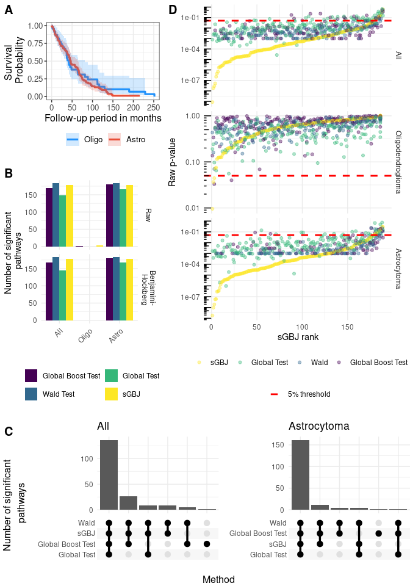

# Draft - sGBJ
TF

# Simulation study

## Simulation setting

- number of genes : $NG = \{10, 50\}$
- number of individuals : $N = \{50, 100\}$
- proportion of significant genes = $0.2$
- proportion of censored individuals : $c = 0.3$
- Variance : $C_{jj} = 0.2$

### Case

- Case (I) : Overall correlation follows a non-standard beta
  $corr \sim NSBeta(20, 20, min=-1, max =1)$
- Case (II) : Correlation between significant genes
  $corr \sim NSBeta(10, 10, min=-1, max =1)$ and between other genes
  $corr \sim NSBeta(25, 25, min=-1, max =1)$

**Note : Case IV and V are not guaranteed to generate positive definite
matrix, after the correlation values are sampled, if the matrix is not
positive definite, the nearest positive definite matrix is computed
using the algorithm defined by Higham 2002 (see Matrix::nearPD). This
correction was not implemented for scenario D, E and F.**

- Case (III) : Correlation between significant genes is $0.2$,
  correlation with non significant genes is $0$.

### Type

- Type (Z) : $\beta = 0$ evaluates the type-I error
- Type (A) : $\beta \sim \mathcal{N}(0, 0.4^2)$. Correlation matrix of
  $\beta$ is the same as correlation matrix of genes.
- Type (B) : half of genes follows $\beta \sim \mathcal{N}(-0.4, 0.2^2)$
  and half follows $\beta \sim \mathcal{N}(0.4, 0.2^2)$. Correlation
  matrix of $\beta$ is the same as correlation matrix of genes.
- Type (C) : half of genes follows $\beta \sim \mathcal{N}(-0.8, 0.4^2)$
  and half follows $\beta \sim \mathcal{N}(0.8, 0.4^2)$. Correlation
  matrix of $\beta$ is the same as correlation matrix of genes.

## Results of simulation study

# Applications

## Breast cancer

### Description

<table class="gt_table" data-quarto-postprocess="true"
data-quarto-disable-processing="false" data-quarto-bootstrap="false">
<colgroup>
<col style="width: 50%" />
<col style="width: 50%" />
</colgroup>
<thead>
<tr class="header gt_col_headings">
<th id="label" class="gt_col_heading gt_columns_bottom_border gt_left"
data-quarto-table-cell-role="th"
scope="col"><strong>Characteristic</strong></th>
<th id="stat_0"
class="gt_col_heading gt_columns_bottom_border gt_center"
data-quarto-table-cell-role="th" scope="col"><strong>N =
260</strong>1</th>
</tr>
</thead>
<tbody class="gt_table_body">
<tr class="odd">
<td class="gt_row gt_left" headers="label">age</td>
<td class="gt_row gt_center" headers="stat_0">45.0 (41.0, 49.0)</td>
</tr>
<tr class="even">
<td class="gt_row gt_left" headers="label">event</td>
<td class="gt_row gt_center" headers="stat_0">88 (34%)</td>
</tr>
<tr class="odd">
<td class="gt_row gt_left" headers="label">time</td>
<td class="gt_row gt_center" headers="stat_0">7.0 (4.9, 10.1)</td>
</tr>
<tr class="even">
<td class="gt_row gt_left" headers="label">grade</td>
<td class="gt_row gt_center" headers="stat_0"> 
</td>
</tr>
<tr class="odd">
<td class="gt_row gt_left" headers="label">    1</td>
<td class="gt_row gt_center" headers="stat_0">70 (27%)</td>
</tr>
<tr class="even">
<td class="gt_row gt_left" headers="label">    2</td>
<td class="gt_row gt_center" headers="stat_0">91 (35%)</td>
</tr>
<tr class="odd">
<td class="gt_row gt_left" headers="label">    3</td>
<td class="gt_row gt_center" headers="stat_0">99 (38%)</td>
</tr>
</tbody><tfoot class="gt_footnotes">
<tr class="even">
<td colspan="2" class="gt_footnote">1
Median (Q1, Q3); n (%)</td>
</tr>
</tfoot>
&#10;</table>

Here are the kaplan meier curves for the two types of disease:

### Breast cancer pathway analysis

Analysis of breast cancer pathway adjusted on age, overall and
stratified by grade.

| Proportion of significant pathway by method and glioma |           |
|--------------------------------------------------------|-----------|
| method                                                 | prop_sign |
| All                                                    |           |
| sGBJ                                                   | 0.708     |
| Global Test                                            | 0.605     |
| Wald                                                   | 0.734     |
| Global Boost Test                                      | 0.258     |
| Grade 1                                                |           |
| sGBJ                                                   | 0.000     |
| Global Test                                            | 0.000     |
| Wald                                                   | 0.061     |
| Global Boost Test                                      | 0.066     |
| Grade 2                                                |           |
| sGBJ                                                   | 0.088     |
| Global Test                                            | 0.011     |
| Wald                                                   | 0.105     |
| Global Boost Test                                      | 0.046     |
| Grade 3                                                |           |
| sGBJ                                                   | 0.000     |
| Global Test                                            | 0.000     |
| Wald                                                   | 0.000     |
| Global Boost Test                                      | 0.000     |

NB about GT test :
https://www.bioconductor.org/packages/release/bioc/vignettes/globaltest/inst/doc/GlobalTest.pdf
: “Because permutations require an exchangeable null hypothesis, such a
permutation p-value is only available for the linear model and for the
exchangeable null hypotheses ~1 and ~0 in other models.”

## Rembrandt

Analysis of rembrandt pathway adjusted on age and sex, overall and
stratified by tumor type.

### Describe Rembrandt cohort

<table class="gt_table" data-quarto-postprocess="true"
data-quarto-disable-processing="false" data-quarto-bootstrap="false">
<colgroup>
<col style="width: 33%" />
<col style="width: 33%" />
<col style="width: 33%" />
</colgroup>
<thead>
<tr class="header gt_col_headings">
<th id="label" class="gt_col_heading gt_columns_bottom_border gt_left"
data-quarto-table-cell-role="th"
scope="col"><strong>Characteristic</strong></th>
<th id="stat_1"
class="gt_col_heading gt_columns_bottom_border gt_center"
data-quarto-table-cell-role="th"
scope="col"><strong>ASTROCYTOMA</strong>  N = 1081</th>
<th id="stat_2"
class="gt_col_heading gt_columns_bottom_border gt_center"
data-quarto-table-cell-role="th"
scope="col"><strong>OLIGODENDROGLIOMA</strong>  N = 461</th>
</tr>
</thead>
<tbody class="gt_table_body">
<tr class="odd">
<td class="gt_row gt_left" headers="label">Age</td>
<td class="gt_row gt_center" headers="stat_1"> 
</td>
<td class="gt_row gt_center" headers="stat_2"> 
</td>
</tr>
<tr class="even">
<td class="gt_row gt_left" headers="label">    &lt; 40</td>
<td class="gt_row gt_center" headers="stat_1">52 (48%)</td>
<td class="gt_row gt_center" headers="stat_2">22 (48%)</td>
</tr>
<tr class="odd">
<td class="gt_row gt_left" headers="label">    &gt;= 40</td>
<td class="gt_row gt_center" headers="stat_1">56 (52%)</td>
<td class="gt_row gt_center" headers="stat_2">24 (52%)</td>
</tr>
<tr class="even">
<td class="gt_row gt_left" headers="label">Sex</td>
<td class="gt_row gt_center" headers="stat_1"> 
</td>
<td class="gt_row gt_center" headers="stat_2"> 
</td>
</tr>
<tr class="odd">
<td class="gt_row gt_left" headers="label">    FEMALE</td>
<td class="gt_row gt_center" headers="stat_1">37 (34%)</td>
<td class="gt_row gt_center" headers="stat_2">23 (50%)</td>
</tr>
<tr class="even">
<td class="gt_row gt_left" headers="label">    MALE</td>
<td class="gt_row gt_center" headers="stat_1">71 (66%)</td>
<td class="gt_row gt_center" headers="stat_2">23 (50%)</td>
</tr>
<tr class="odd">
<td class="gt_row gt_left" headers="label">Death</td>
<td class="gt_row gt_center" headers="stat_1">85 (79%)</td>
<td class="gt_row gt_center" headers="stat_2">34 (74%)</td>
</tr>
<tr class="even">
<td class="gt_row gt_left" headers="label">Follow-up period in
months</td>
<td class="gt_row gt_center" headers="stat_1">37 (15, 67)</td>
<td class="gt_row gt_center" headers="stat_2">32 (16, 49)</td>
</tr>
</tbody><tfoot class="gt_footnotes">
<tr class="odd">
<td colspan="3" class="gt_footnote">1
n (%); Median (Q1, Q3)</td>
</tr>
</tfoot>
&#10;</table>

Here are the kaplan meier curves for the two types of disease:

### Rembrandt pathway analysis

| Proportion of significant pathway by method and glioma |           |
|--------------------------------------------------------|-----------|
| method                                                 | prop_sign |
| All                                                    |           |
| sGBJ                                                   | 0.942     |
| Global Test                                            | 0.767     |
| Wald                                                   | 0.968     |
| Global Boost Test                                      | 0.889     |
| Oligodendroglioma                                      |           |
| sGBJ                                                   | 0.000     |
| Global Test                                            | 0.000     |
| Wald                                                   | 0.000     |
| Global Boost Test                                      | 0.000     |
| Astrocytoma                                            |           |
| sGBJ                                                   | 0.942     |
| Global Test                                            | 0.884     |
| Wald                                                   | 0.968     |
| Global Boost Test                                      | 0.952     |

NB about GT test :
https://www.bioconductor.org/packages/release/bioc/vignettes/globaltest/inst/doc/GlobalTest.pdf
: “Because permutations require an exchangeable null hypothesis, such a
permutation p-value is only available for the linear model and for the
exchangeable null hypotheses ~1 and ~0 in other models.”

