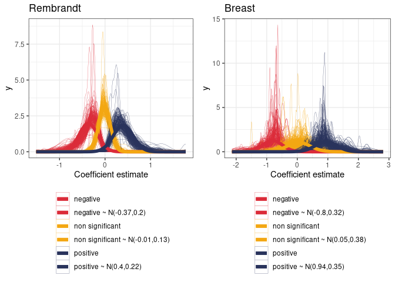
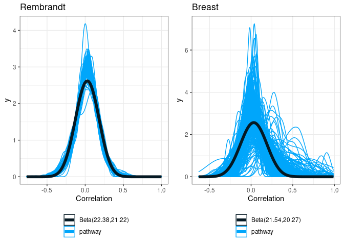

VarCovar Rembrandt
================
TF
2023-06-09

- <a href="#1-rembrandt" id="toc-1-rembrandt">1 Rembrandt</a>
  - <a href="#11-proportion-of-significant-genes"
    id="toc-11-proportion-of-significant-genes">1.1 Proportion of
    significant genes</a>
  - <a href="#12-beta" id="toc-12-beta">1.2 Beta</a>
  - <a href="#13-variance" id="toc-13-variance">1.3 Variance</a>
  - <a href="#14-correlation" id="toc-14-correlation">1.4 Correlation</a>
  - <a href="#15-summary-rembrandt" id="toc-15-summary-rembrandt">1.5
    Summary Rembrandt</a>

Each dot in the following figure corresponds to one pathway.

# 1 Rembrandt

## 1.1 Proportion of significant genes

<!-- -->

Choices :

- number of genes : $NG = \{10, 50, 200\}$
- proportion of significant genes : $p_g = \{0.2, 0.5\}$

## 1.2 Beta

<table class="table" style="margin-left: auto; margin-right: auto;">
<caption>

Table 1.1: Rembrandt : Proportion of positive, negative and non
significant genes

</caption>
<thead>
<tr>
<th style="text-align:right;">

prop_pos

</th>
<th style="text-align:right;">

prop_neg

</th>
<th style="text-align:right;">

prop_null

</th>
</tr>
</thead>
<tbody>
<tr>
<td style="text-align:right;">

0.2048393

</td>
<td style="text-align:right;">

0.2619928

</td>
<td style="text-align:right;">

0.5331679

</td>
</tr>
</tbody>
</table>
<table class="table" style="margin-left: auto; margin-right: auto;">
<caption>

Table 1.1: Breast cancer : Proportion of positive, negative and non
significant genes

</caption>
<thead>
<tr>
<th style="text-align:right;">

prop_pos

</th>
<th style="text-align:right;">

prop_neg

</th>
<th style="text-align:right;">

prop_null

</th>
</tr>
</thead>
<tbody>
<tr>
<td style="text-align:right;">

0.1262521

</td>
<td style="text-align:right;">

0.0972775

</td>
<td style="text-align:right;">

0.7764703

</td>
</tr>
</tbody>
</table>

Proportions are roughly similar between positive and negative genes.

<!-- -->

<!-- -->

Choices :

- $\beta \sim \mathcal{N}(0, 0.4^2)$
- half of genes follows $\beta \sim \mathcal{N}(-0.4, 0.2^2)$ and half
  follows $\beta \sim \mathcal{N}(0.4, 0.2^2)$
- half of genes follows $\beta \sim \mathcal{N}(-0.8, 0.4^2)$ and half
  follows $\beta \sim \mathcal{N}(0.8, 0.4^2)$

## 1.3 Variance

<!-- -->

Choice :

- Variance : $C_{jj} = 0.2$

## 1.4 Correlation

<!-- -->

<table class="table" style="margin-left: auto; margin-right: auto;">
<caption>

Table 1.2: Rembrandt : Shapes of non-standard beta distribution by type
of gene

</caption>
<thead>
<tr>
<th style="text-align:left;">

Type

</th>
<th style="text-align:right;">

shape1

</th>
<th style="text-align:right;">

shape2

</th>
</tr>
</thead>
<tbody>
<tr>
<td style="text-align:left;">

non sign with non sign

</td>
<td style="text-align:right;">

34.13285

</td>
<td style="text-align:right;">

31.72376

</td>
</tr>
<tr>
<td style="text-align:left;">

sign with non sign

</td>
<td style="text-align:right;">

27.61729

</td>
<td style="text-align:right;">

26.30521

</td>
</tr>
<tr>
<td style="text-align:left;">

sign with sign

</td>
<td style="text-align:right;">

11.80011

</td>
<td style="text-align:right;">

11.36092

</td>
</tr>
</tbody>
</table>
<table class="table" style="margin-left: auto; margin-right: auto;">
<caption>

Table 1.2: Breast : Shapes of non-standard beta distribution by type of
gene

</caption>
<thead>
<tr>
<th style="text-align:left;">

Type

</th>
<th style="text-align:right;">

shape1

</th>
<th style="text-align:right;">

shape2

</th>
</tr>
</thead>
<tbody>
<tr>
<td style="text-align:left;">

non sign with non sign

</td>
<td style="text-align:right;">

23.569954

</td>
<td style="text-align:right;">

22.264556

</td>
</tr>
<tr>
<td style="text-align:left;">

sign with non sign

</td>
<td style="text-align:right;">

23.057991

</td>
<td style="text-align:right;">

21.943974

</td>
</tr>
<tr>
<td style="text-align:left;">

sign with sign

</td>
<td style="text-align:right;">

8.115747

</td>
<td style="text-align:right;">

6.629806

</td>
</tr>
</tbody>
</table>

<!-- -->

Choice :

- Overall correlation follows a non-standard beta
  $corr \sim NSBeta(20, 20, min=-1, max =1)$
- Correlation between significant genes
  $corr \sim NSBeta(10, 10, min=-1, max =1)$ and between other genes
  $corr \sim NSBeta(25, 25, min=-1, max =1)$

## 1.5 Summary Rembrandt

Taking paper notations :

- number of genes : $NG = \{10, 50, 200\}$
- proportion of significant genes : $p_g = \{0.2, 0.5\}$
- Variance : $C_{jj} = 0.2$
- Type (D) : $\beta \sim \mathcal{N}(0, 0.4^2)$
- Type (E) : half of genes follows $\beta \sim \mathcal{N}(-0.4, 0.2^2)$
  and half follows $\beta \sim \mathcal{N}(0.4, 0.2^2)$
- Type (F) : half of genes follows $\beta \sim \mathcal{N}(-0.8, 0.4^2)$
  and half follows $\beta \sim \mathcal{N}(0.8, 0.4^2)$
- Case (IV) : Overall correlation follows a non-standard beta
  $corr \sim NSBeta(20, 20, min=-1, max =1)$
- Case (V) : Correlation between significant genes
  $corr \sim NSBeta(10, 10, min=-1, max =1)$ and between other genes
  $corr \sim NSBeta(25, 25, min=-1, max =1)$

Nb of simulations to perform = $3*2*3*2 = 36$
