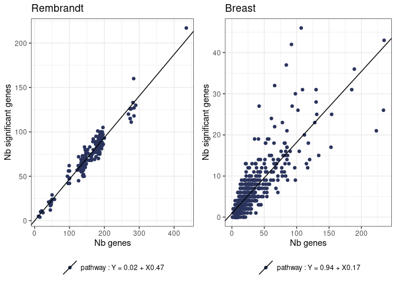
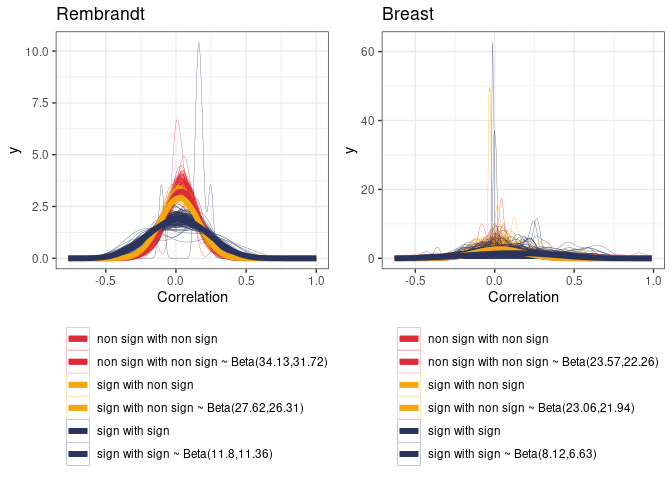

VarCovar Rembrandt
================
TF
2023-06-21

- <a href="#1-introduction" id="toc-1-introduction">1 Introduction</a>
- <a href="#2-finding-the-simulation-setting"
  id="toc-2-finding-the-simulation-setting">2 Finding the simulation
  setting</a>
  - <a href="#21-proportion-of-significant-genes"
    id="toc-21-proportion-of-significant-genes">2.1 Proportion of
    significant genes</a>
  - <a href="#22-beta" id="toc-22-beta">2.2 Beta</a>
  - <a href="#23-variance" id="toc-23-variance">2.3 Variance</a>
  - <a href="#24-correlation" id="toc-24-correlation">2.4 Correlation</a>
  - <a href="#25-summary-rembrandt" id="toc-25-summary-rembrandt">2.5
    Summary Rembrandt</a>
- <a href="#3-results-of-simulation-study"
  id="toc-3-results-of-simulation-study">3 Results of simulation study</a>
  - <a href="#31-comprehend-tests" id="toc-31-comprehend-tests">3.1
    Comprehend tests</a>
    - <a href="#311-wald-test" id="toc-311-wald-test">3.1.1 Wald test</a>
    - <a href="#312-global-test" id="toc-312-global-test">3.1.2 Global
      test</a>
    - <a href="#313-global-boost-test" id="toc-313-global-boost-test">3.1.3
      Global boost test</a>
    - <a href="#314-thinking" id="toc-314-thinking">3.1.4 Thinking</a>

Each dot in the following figure corresponds to one pathway.

# 1 Introduction

Document is separated into two parts

- First part goal is to find relevant simulation setting from Rembrandt
  and Breast cancer study.
- Second part will present the results from the simulation studies

# 2 Finding the simulation setting

## 2.1 Proportion of significant genes

<!-- -->

Choices :

- number of genes : $NG = \{10, 50, 200\}$
- proportion of significant genes : $p_g = \{0.2, 0.5\}$

## 2.2 Beta

<table class="table" style="margin-left: auto; margin-right: auto;">
<caption>

Table 2.1: Rembrandt : Proportion of positive, negative and non
significant genes

</caption>
<thead>
<tr>
<th style="text-align:right;">

prop_pos

</th>
<th style="text-align:right;">

prop_neg

</th>
<th style="text-align:right;">

prop_null

</th>
</tr>
</thead>
<tbody>
<tr>
<td style="text-align:right;">

0.2048393

</td>
<td style="text-align:right;">

0.2619928

</td>
<td style="text-align:right;">

0.5331679

</td>
</tr>
</tbody>
</table>
<table class="table" style="margin-left: auto; margin-right: auto;">
<caption>

Table 2.1: Breast cancer : Proportion of positive, negative and non
significant genes

</caption>
<thead>
<tr>
<th style="text-align:right;">

prop_pos

</th>
<th style="text-align:right;">

prop_neg

</th>
<th style="text-align:right;">

prop_null

</th>
</tr>
</thead>
<tbody>
<tr>
<td style="text-align:right;">

0.1262521

</td>
<td style="text-align:right;">

0.0972775

</td>
<td style="text-align:right;">

0.7764703

</td>
</tr>
</tbody>
</table>

Proportions are roughly similar between positive and negative genes.

<!-- -->

<!-- -->

Choices :

- $\beta \sim \mathcal{N}(0, 0.4^2)$
- half of genes follows $\beta \sim \mathcal{N}(-0.4, 0.2^2)$ and half
  follows $\beta \sim \mathcal{N}(0.4, 0.2^2)$
- half of genes follows $\beta \sim \mathcal{N}(-0.8, 0.4^2)$ and half
  follows $\beta \sim \mathcal{N}(0.8, 0.4^2)$

## 2.3 Variance

<!-- -->

Choice :

- Variance : $C_{jj} = 0.2$

## 2.4 Correlation

<!-- -->

<table class="table" style="margin-left: auto; margin-right: auto;">
<caption>

Table 2.2: Rembrandt : Shapes of non-standard beta distribution by type
of gene

</caption>
<thead>
<tr>
<th style="text-align:left;">

Type

</th>
<th style="text-align:right;">

shape1

</th>
<th style="text-align:right;">

shape2

</th>
</tr>
</thead>
<tbody>
<tr>
<td style="text-align:left;">

non sign with non sign

</td>
<td style="text-align:right;">

34.13285

</td>
<td style="text-align:right;">

31.72376

</td>
</tr>
<tr>
<td style="text-align:left;">

sign with non sign

</td>
<td style="text-align:right;">

27.61729

</td>
<td style="text-align:right;">

26.30521

</td>
</tr>
<tr>
<td style="text-align:left;">

sign with sign

</td>
<td style="text-align:right;">

11.80011

</td>
<td style="text-align:right;">

11.36092

</td>
</tr>
</tbody>
</table>
<table class="table" style="margin-left: auto; margin-right: auto;">
<caption>

Table 2.2: Breast : Shapes of non-standard beta distribution by type of
gene

</caption>
<thead>
<tr>
<th style="text-align:left;">

Type

</th>
<th style="text-align:right;">

shape1

</th>
<th style="text-align:right;">

shape2

</th>
</tr>
</thead>
<tbody>
<tr>
<td style="text-align:left;">

non sign with non sign

</td>
<td style="text-align:right;">

23.569954

</td>
<td style="text-align:right;">

22.264556

</td>
</tr>
<tr>
<td style="text-align:left;">

sign with non sign

</td>
<td style="text-align:right;">

23.057991

</td>
<td style="text-align:right;">

21.943974

</td>
</tr>
<tr>
<td style="text-align:left;">

sign with sign

</td>
<td style="text-align:right;">

8.115747

</td>
<td style="text-align:right;">

6.629806

</td>
</tr>
</tbody>
</table>

<!-- -->

Choice :

- Overall correlation follows a non-standard beta
  $corr \sim NSBeta(20, 20, min=-1, max =1)$
- Correlation between significant genes
  $corr \sim NSBeta(10, 10, min=-1, max =1)$ and between other genes
  $corr \sim NSBeta(25, 25, min=-1, max =1)$

## 2.5 Summary Rembrandt

Taking paper notations :

- number of genes : $NG = \{10, 50, 200\}$
- proportion of significant genes : $p_g = \{0.2, 0.5\}$
- Variance : $C_{jj} = 0.2$
- Type (D) : $\beta \sim \mathcal{N}(0, 0.4^2)$
- Type (E) : half of genes follows $\beta \sim \mathcal{N}(-0.4, 0.2^2)$
  and half follows $\beta \sim \mathcal{N}(0.4, 0.2^2)$
- Type (F) : half of genes follows $\beta \sim \mathcal{N}(-0.8, 0.4^2)$
  and half follows $\beta \sim \mathcal{N}(0.8, 0.4^2)$
- Case (IV) : Overall correlation follows a non-standard beta
  $corr \sim NSBeta(20, 20, min=-1, max =1)$
- Case (V) : Correlation between significant genes
  $corr \sim NSBeta(10, 10, min=-1, max =1)$ and between other genes
  $corr \sim NSBeta(25, 25, min=-1, max =1)$

Nb of simulations to perform = $3*2*3*2 = 36$

# 3 Results of simulation study

Figure 3.1: Statistical power depending on simulation setting. N is the
number of patients and NG the number of genes in the pathway.

Overall, all methods have close statistical power but sGBJ and Global
boost test tends to be among the worst methods. There are some
exceptions to note :

- Global Boost Test performs well in type F
- sGBJ performs well when N = 100 and NG = 50 which might be related to
  its asymptotic nature.
- In other cases, Wald and Global Test slightly outperformed other
  methods and Wald seems better than Global Test.

## 3.1 Comprehend tests

see : <https://www.ncbi.nlm.nih.gov/pmc/articles/PMC3196970/>

### 3.1.1 Wald test

- estimate one beta by gene using cox model
- sum the wald test statistics
- H0 : variance of beta is equal to 0.

### 3.1.2 Global test

Jelle J. Goeman and others, Testing association of a pathway with
survival using gene expression data, Bioinformatics, Volume 21, Issue 9,
May 2005, Pages 1950–1957,
<https://doi.org/10.1093/bioinformatics/bti267>

- estimate one beta by gene using cox model
- makes the assumption that beta are centered on 0
- H0 : variance of beta is equal to 0.

### 3.1.3 Global boost test

Compute the cox model negative likelihood using a boosted multivariate
(all genes) cox model. P-value is computed by permutation on the
negative likelihood.

### 3.1.4 Thinking

So basically, Wald and Global are super similar, Global test would have
been expected to perform better in D case because the hypothesis on beta
distribution is closer. One explanation could be that this test is
optimal for small deviations from null hypothesis. This might explain
why is seems better than Wald where power is low and why Wald is better
when power is high.

Global boost test relies on one model for all the data contrary to other
models that perform one model by gene which might makes it more adapted
to large number of genes. This is partially in line with good
performance when N = 50.

sGBJ is similar to Wald and Global test in the sense that it is based on
one cox model by feature. However, it takes into account the covariance
of genes in its formula. And the data are simulated with no covariance
of beta =\> Problem ? look at GBJ paper
