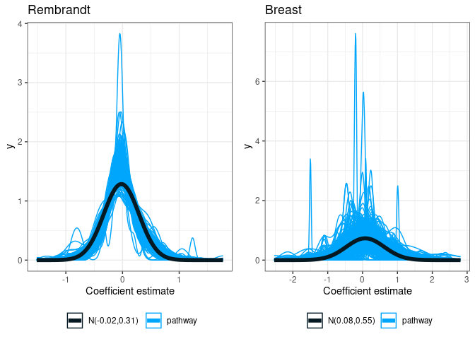
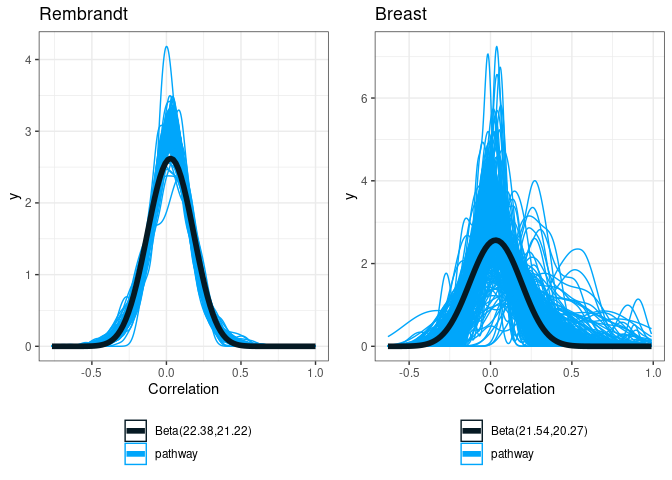

VarCovar Rembrandt
================
TF
2024-08-07

- <a href="#1-introduction" id="toc-1-introduction">1 Introduction</a>
- <a href="#2-finding-the-simulation-setting"
  id="toc-2-finding-the-simulation-setting">2 Finding the simulation
  setting</a>
  - <a href="#21-proportion-of-significant-genes"
    id="toc-21-proportion-of-significant-genes">2.1 Proportion of
    significant genes</a>
  - <a href="#22-beta-from-cox-model" id="toc-22-beta-from-cox-model">2.2
    Beta from Cox model</a>
  - <a href="#23-gene-expression-variance"
    id="toc-23-gene-expression-variance">2.3 Gene expression variance</a>
  - <a href="#24-gene-expression-correlation"
    id="toc-24-gene-expression-correlation">2.4 Gene expression
    correlation</a>
    - <a href="#241-overall-gene-expression-correlation"
      id="toc-241-overall-gene-expression-correlation">2.4.1 Overall gene
      expression correlation</a>
    - <a
      href="#242-gene-expression-correlation-depending-on-gene-significance"
      id="toc-242-gene-expression-correlation-depending-on-gene-significance">2.4.2
      Gene expression correlation depending on gene significance</a>
  - <a href="#25-summary-rembrandt-and-simulation-settings"
    id="toc-25-summary-rembrandt-and-simulation-settings">2.5 Summary
    Rembrandt and simulation settings</a>
    - <a href="#251-case" id="toc-251-case">2.5.1 Case</a>
    - <a href="#252-type" id="toc-252-type">2.5.2 Type</a>
- <a href="#3-results-of-simulation-study"
  id="toc-3-results-of-simulation-study">3 Results of simulation study</a>
- <a href="#4-discussion" id="toc-4-discussion">4 Discussion</a>
- <a href="#5-notes" id="toc-5-notes">5 Notes</a>
  - <a href="#51-wald-test" id="toc-51-wald-test">5.1 Wald test</a>
  - <a href="#52-global-test" id="toc-52-global-test">5.2 Global test</a>
  - <a href="#53-global-boost-test" id="toc-53-global-boost-test">5.3 Global
    boost test</a>
  - <a href="#54-thinking" id="toc-54-thinking">5.4 Thinking</a>

# 1 Introduction

Document is separated into two parts

- First part goal is to find relevant simulation setting from Rembrandt
  and Breast cancer study.
- Second part will present the results from the simulation studies

# 2 Finding the simulation setting

We used Rembrandt and breast cancer datasets. For each datasets we
explored the parameters of interest to perform the simulation study.

Each dot in the following figure corresponds to one pathway.

## 2.1 Proportion of significant genes

<!-- -->

Choices :

- number of genes : $NG = \{10, 50, 200\}$
- proportion of significant genes : $p_g = \{0.2, 0.5\}$

## 2.2 Beta from Cox model

<table class="table" style="margin-left: auto; margin-right: auto;">
<caption>

Table 2.1: Rembrandt : Proportion of positive, negative and non
significant genes

</caption>
<thead>
<tr>
<th style="text-align:right;">

prop_pos

</th>
<th style="text-align:right;">

prop_neg

</th>
<th style="text-align:right;">

prop_null

</th>
</tr>
</thead>
<tbody>
<tr>
<td style="text-align:right;">

0.2048393

</td>
<td style="text-align:right;">

0.2619928

</td>
<td style="text-align:right;">

0.5331679

</td>
</tr>
</tbody>
</table>
<table class="table" style="margin-left: auto; margin-right: auto;">
<caption>

Table 2.1: Breast cancer : Proportion of positive, negative and non
significant genes

</caption>
<thead>
<tr>
<th style="text-align:right;">

prop_pos

</th>
<th style="text-align:right;">

prop_neg

</th>
<th style="text-align:right;">

prop_null

</th>
</tr>
</thead>
<tbody>
<tr>
<td style="text-align:right;">

0.1262521

</td>
<td style="text-align:right;">

0.0972775

</td>
<td style="text-align:right;">

0.7764703

</td>
</tr>
</tbody>
</table>

Proportions are roughly similar between positive and negative genes.

<!-- -->

<!-- -->

Choices :

- $\beta \sim \mathcal{N}(0, 0.4^2)$
- half of genes follows $\beta \sim \mathcal{N}(-0.4, 0.2^2)$ and half
  follows $\beta \sim \mathcal{N}(0.4, 0.2^2)$
- half of genes follows $\beta \sim \mathcal{N}(-0.8, 0.4^2)$ and half
  follows $\beta \sim \mathcal{N}(0.8, 0.4^2)$

## 2.3 Gene expression variance

<!-- -->

Choice :

- Variance : $C_{jj} = 0.2$

## 2.4 Gene expression correlation

### 2.4.1 Overall gene expression correlation

<!-- -->

<table class="table" style="margin-left: auto; margin-right: auto;">
<caption>

Table 2.2: Rembrandt : Shapes of non-standard beta distribution by type
of gene

</caption>
<thead>
<tr>
<th style="text-align:left;">

Type

</th>
<th style="text-align:right;">

shape1

</th>
<th style="text-align:right;">

shape2

</th>
</tr>
</thead>
<tbody>
<tr>
<td style="text-align:left;">

non sign with non sign

</td>
<td style="text-align:right;">

34.13285

</td>
<td style="text-align:right;">

31.72376

</td>
</tr>
<tr>
<td style="text-align:left;">

sign with non sign

</td>
<td style="text-align:right;">

27.61729

</td>
<td style="text-align:right;">

26.30521

</td>
</tr>
<tr>
<td style="text-align:left;">

sign with sign

</td>
<td style="text-align:right;">

11.80011

</td>
<td style="text-align:right;">

11.36092

</td>
</tr>
</tbody>
</table>
<table class="table" style="margin-left: auto; margin-right: auto;">
<caption>

Table 2.2: Breast : Shapes of non-standard beta distribution by type of
gene

</caption>
<thead>
<tr>
<th style="text-align:left;">

Type

</th>
<th style="text-align:right;">

shape1

</th>
<th style="text-align:right;">

shape2

</th>
</tr>
</thead>
<tbody>
<tr>
<td style="text-align:left;">

non sign with non sign

</td>
<td style="text-align:right;">

23.569954

</td>
<td style="text-align:right;">

22.264556

</td>
</tr>
<tr>
<td style="text-align:left;">

sign with non sign

</td>
<td style="text-align:right;">

23.057991

</td>
<td style="text-align:right;">

21.943974

</td>
</tr>
<tr>
<td style="text-align:left;">

sign with sign

</td>
<td style="text-align:right;">

8.115747

</td>
<td style="text-align:right;">

6.629806

</td>
</tr>
</tbody>
</table>

### 2.4.2 Gene expression correlation depending on gene significance

<!-- -->

Choice :

- Overall correlation follows a non-standard beta
  $corr \sim NSBeta(20, 20, min=-1, max =1)$
- Correlation between significant genes
  $corr \sim NSBeta(10, 10, min=-1, max =1)$ and between other genes
  $corr \sim NSBeta(25, 25, min=-1, max =1)$

## 2.5 Summary Rembrandt and simulation settings

Taking paper notations :

- number of genes : $NG = \{10, 50, 200\}$
- number of individuals : $N = \{50, 100\}$
- proportion of significant genes : $p_g = \{0.2, 0.5\}$
- proportion of censored genes : $c = \{0, 0.3\}$
- Variance : $C_{jj} = 0.2$

<!-- **Note : scenario D, E and F do not rely on correlation matrix to simulate variance covariance matrix so the those matrix are unlikely to be positive definite.** -->

### 2.5.1 Case

- Case 4 : Overall correlation follows a non-standard beta
  $corr \sim NSBeta(20, 20, min=-1, max =1)$
- Case 5 : Correlation between significant genes
  $corr \sim NSBeta(10, 10, min=-1, max =1)$ and between other genes
  $corr \sim NSBeta(25, 25, min=-1, max =1)$

**Note : Case IV and V are not guaranteed to generate positive definite
matrix, after the correlation values are sampled, if the matrix is not
positive definite, the nearest positive definite matrix is computed
using the algorithm defined by Higham 2002 (see Matrix::nearPD). This
correction was not implemented for scenario D, E and F.**

- Case 6 : Correlation between significant genes is $0.2$, correlation
  with non significant genes is $0$.

### 2.5.2 Type

- Type (Z) : $\beta = 0$ evaluates the type-I error
- Type (D) : $\beta \sim \mathcal{N}(0, 0.4^2)$
- Type (E) : half of genes follows $\beta \sim \mathcal{N}(-0.4, 0.2^2)$
  and half follows $\beta \sim \mathcal{N}(0.4, 0.2^2)$
- Type (F) : half of genes follows $\beta \sim \mathcal{N}(-0.8, 0.4^2)$
  and half follows $\beta \sim \mathcal{N}(0.8, 0.4^2)$
- Type (G) : $\beta \sim \mathcal{N}(0, 0.4^2)$. Correlation matrix of
  $\beta$ is the same as correlation matrix of genes.
- Type (H) : half of genes follows $\beta \sim \mathcal{N}(-0.4, 0.2^2)$
  and half follows $\beta \sim \mathcal{N}(0.4, 0.2^2)$. Correlation
  matrix of $\beta$ is the same as correlation matrix of genes.
- Type (I) : half of genes follows $\beta \sim \mathcal{N}(-0.8, 0.4^2)$
  and half follows $\beta \sim \mathcal{N}(0.8, 0.4^2)$. Correlation
  matrix of $\beta$ is the same as correlation matrix of genes.

# 3 Results of simulation study

Figure 3.1: Statistical power depending on simulation setting. N is the
number of patients and NG the number of genes in the pathway. Note :
scenario D, E and F do not rely on correlation matrix to simulate
variance covariance matrix so the those matrix are unlikely to be
positive definite.

Figure 3.2: Statistical power depending on simulation setting (second
batch). N is the number of patients and NG the number of genes in the
pathway.

Figure 3.3: Type-I error (Type = Z). N is the number of patients and NG
the number of genes in the pathway. Vertical bars represent 95%
confidence intervals with exact method.

Figure 3.4: Time depending on simulation setting (second batch). N is
the number of patients and NG the number of genes in the pathway.

# 4 Discussion

Overall :

- Global Test is fast compared to other approach. It is not completely
  clear to me why because it also relies on permutation and is similar
  to Wald test. There is probably a clever implementation ?
- In terms of power Wald test is the best option, closely followed by
  Global test
- Type-I error is well controlled by the different methods. We note that
  sGBJ is too conservative when the number of genes is high.
- sGBJ is slow when the number of genes rise. This is due to permutation
  for variance matrix estimation that might be reduced to improve
  computation time.
- sGBJ performance is similar to most approach except when the number of
  genes increases which is partly explained by the over-conservative
  control of Type-I error.

# 5 Notes

see : <https://www.ncbi.nlm.nih.gov/pmc/articles/PMC3196970/>

## 5.1 Wald test

- estimate one beta by gene using cox model
- sum the wald test statistics

## 5.2 Global test

Jelle J. Goeman and others, Testing association of a pathway with
survival using gene expression data, Bioinformatics, Volume 21, Issue 9,
May 2005, Pages 1950–1957,
<https://doi.org/10.1093/bioinformatics/bti267>

- estimate one beta by gene using cox model
- makes the assumption that beta are centered on 0
- H0 : variance of beta is equal to 0.

## 5.3 Global boost test

Compute the cox model negative likelihood using a boosted multivariate
(all genes) cox model. P-value is computed by permutation on the
negative likelihood.

## 5.4 Thinking

So basically, Wald and Global are super similar, Global test would have
been expected to perform better in D case because the hypothesis on beta
distribution is closer. One explanation could be that this test is
optimal for small deviations from null hypothesis. This might explain
why is seems better than Wald where power is low and why Wald is better
when power is high.

Global boost test relies on one model for all the data contrary to other
models that perform one model by gene which might makes it more adapted
to large number of genes. This is partially in line with good
performance when N = 50.

sGBJ is similar to Wald and Global test in the sense that it is based on
one cox model by feature. However, it takes into account the covariance
of genes in its formula so it should perform better when beta are
correlated.
