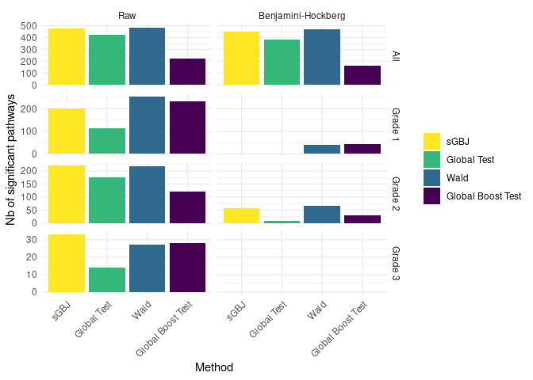
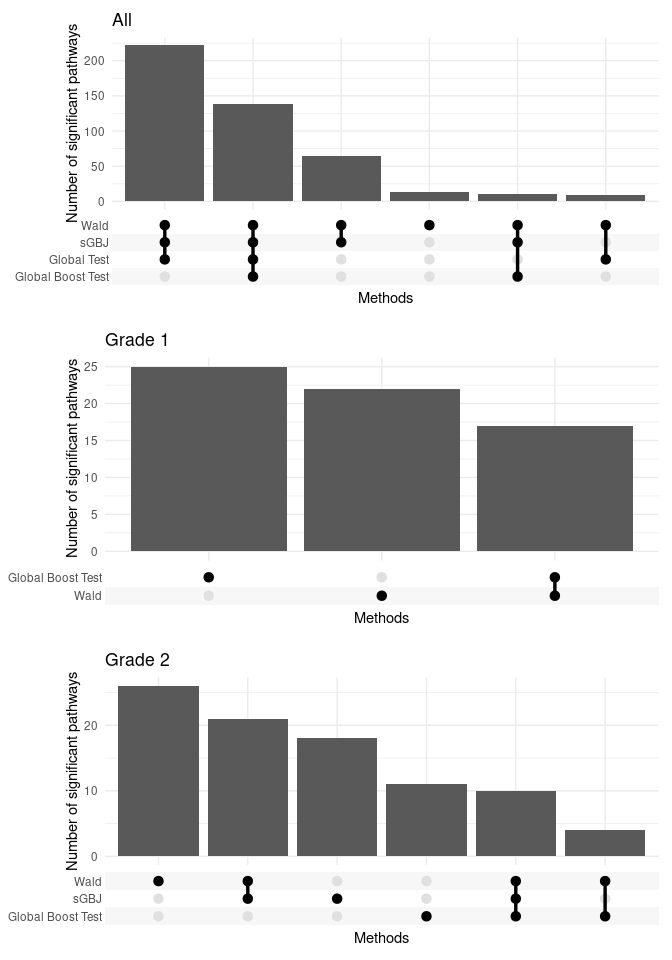

Breast cancer
================
TF

- <a href="#describe-breast-cancer-cohort"
  id="toc-describe-breast-cancer-cohort">Describe Breast Cancer cohort</a>
- <a href="#breast-cancer-pathway-analysis"
  id="toc-breast-cancer-pathway-analysis">Breast cancer pathway
  analysis</a>
  - <a href="#description-of-pathways"
    id="toc-description-of-pathways">Description of pathways</a>
  - <a href="#methods-comparison" id="toc-methods-comparison">Methods
    comparison</a>

# Describe Breast Cancer cohort

<table class="gt_table">
  
  <thead class="gt_col_headings">
    <tr>
      <th class="gt_col_heading gt_columns_bottom_border gt_left" rowspan="1" colspan="1" scope="col" id="&lt;strong&gt;Characteristic&lt;/strong&gt;"><strong>Characteristic</strong></th>
      <th class="gt_col_heading gt_columns_bottom_border gt_center" rowspan="1" colspan="1" scope="col" id="&lt;strong&gt;N = 260&lt;/strong&gt;&lt;sup class=&quot;gt_footnote_marks&quot;&gt;1&lt;/sup&gt;"><strong>N = 260</strong>1</th>
    </tr>
  </thead>
  <tbody class="gt_table_body">
    <tr><td headers="label" class="gt_row gt_left">age</td>
<td headers="stat_0" class="gt_row gt_center">45.0 (41.0, 49.0)</td></tr>
    <tr><td headers="label" class="gt_row gt_left">event</td>
<td headers="stat_0" class="gt_row gt_center">88 (34%)</td></tr>
    <tr><td headers="label" class="gt_row gt_left">time</td>
<td headers="stat_0" class="gt_row gt_center">7.0 (4.9, 10.1)</td></tr>
    <tr><td headers="label" class="gt_row gt_left">grade</td>
<td headers="stat_0" class="gt_row gt_center"></td></tr>
    <tr><td headers="label" class="gt_row gt_left">    1</td>
<td headers="stat_0" class="gt_row gt_center">70 (27%)</td></tr>
    <tr><td headers="label" class="gt_row gt_left">    2</td>
<td headers="stat_0" class="gt_row gt_center">91 (35%)</td></tr>
    <tr><td headers="label" class="gt_row gt_left">    3</td>
<td headers="stat_0" class="gt_row gt_center">99 (38%)</td></tr>
  </tbody>
  
  <tfoot class="gt_footnotes">
    <tr>
      <td class="gt_footnote" colspan="2">1 Median (IQR); n (%)</td>
    </tr>
  </tfoot>
</table>

Figure 1: Breast cancer count per patient per tumor type

Figure 2: First two PCA factorial plans

Here are the kaplan meier curves for the two types of disease:

Figure 3: Kaplan meier curves for Astro, Oligo

# Breast cancer pathway analysis

## Description of pathways

Figure 4: Empirical Cumulative Distribution Function of number of genes
by pathway. Breast cancer study.

## Methods comparison

Figure 5: Number of significant pathways by method.

Figure 6: Upset plot of the Benjamini-Hockberg p-value agreement
according to the different methods

Figure 7: Raw p-values in function of the ordered ranks of sGBJ for the
4 methods (sGBJ , global boost test, Wald test and global test), with
the 5% threshold and the Benjamini Hochberg limit, computed for
astrocytoma, oligodendroglioma and all patients. Nota Bene: The
Benjamini Hochberg limit only applies for the sGBJ method, as the ranks
are computed for sGBJ only.

NB about GT test :
<https://www.bioconductor.org/packages/release/bioc/vignettes/globaltest/inst/doc/GlobalTest.pdf>
: “Because permutations require an exchangeable null hypothesis, such a
permutation p-value is only available for the linear model and for the
exchangeable null hypotheses \~1 and \~0 in other models.”
