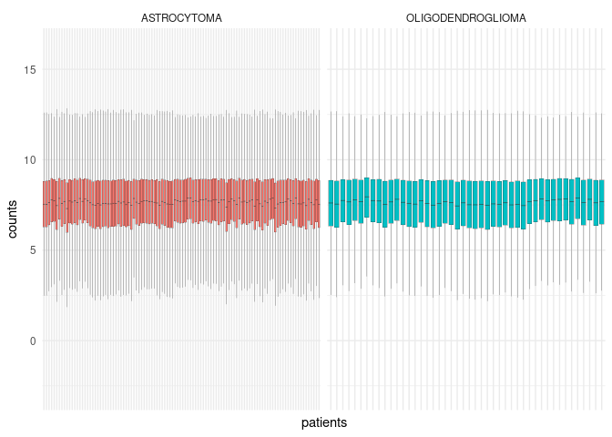
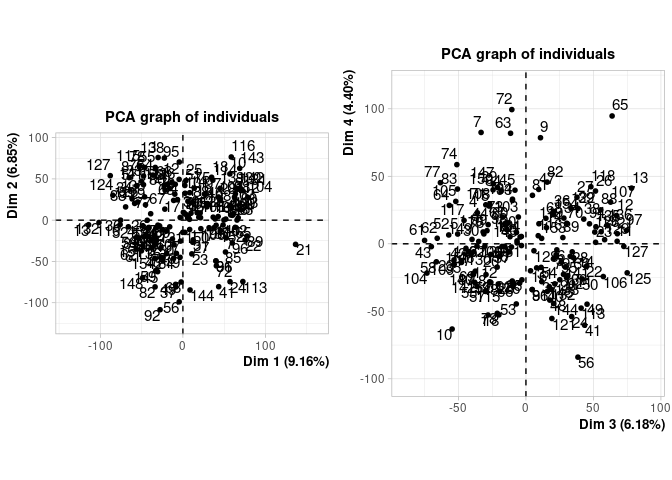
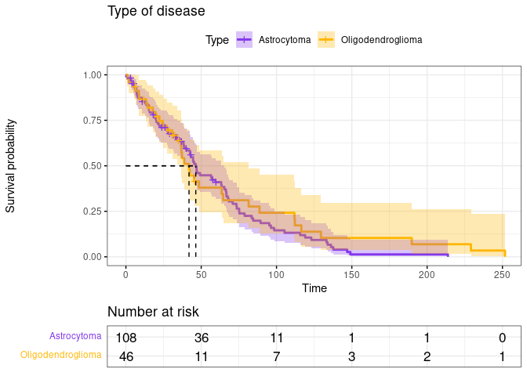
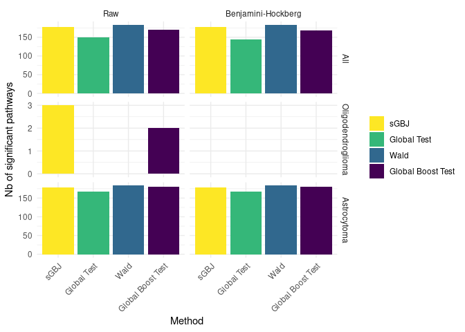
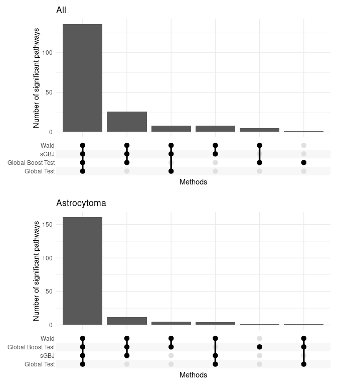
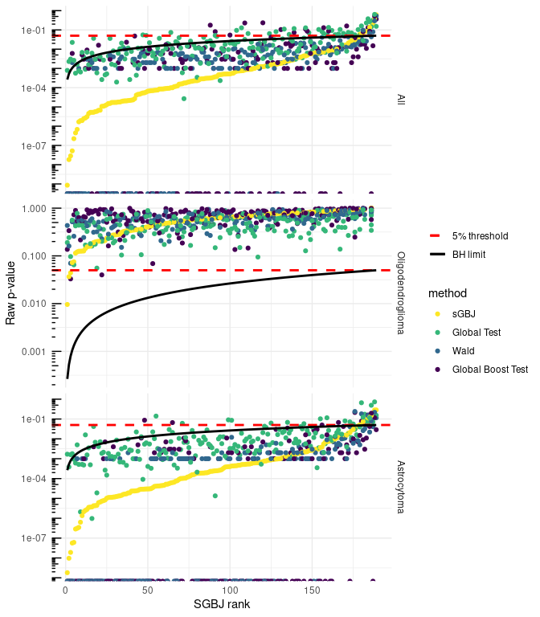

# Describe Rembrandt cohort


```{=html}
<div id="fuznrdgbsx" style="padding-left:0px;padding-right:0px;padding-top:10px;padding-bottom:10px;overflow-x:auto;overflow-y:auto;width:auto;height:auto;">
<style>html {
  font-family: -apple-system, BlinkMacSystemFont, 'Segoe UI', Roboto, Oxygen, Ubuntu, Cantarell, 'Helvetica Neue', 'Fira Sans', 'Droid Sans', Arial, sans-serif;
}

#fuznrdgbsx .gt_table {
  display: table;
  border-collapse: collapse;
  margin-left: auto;
  margin-right: auto;
  color: #333333;
  font-size: 16px;
  font-weight: normal;
  font-style: normal;
  background-color: #FFFFFF;
  width: auto;
  border-top-style: solid;
  border-top-width: 2px;
  border-top-color: #A8A8A8;
  border-right-style: none;
  border-right-width: 2px;
  border-right-color: #D3D3D3;
  border-bottom-style: solid;
  border-bottom-width: 2px;
  border-bottom-color: #A8A8A8;
  border-left-style: none;
  border-left-width: 2px;
  border-left-color: #D3D3D3;
}

#fuznrdgbsx .gt_heading {
  background-color: #FFFFFF;
  text-align: center;
  border-bottom-color: #FFFFFF;
  border-left-style: none;
  border-left-width: 1px;
  border-left-color: #D3D3D3;
  border-right-style: none;
  border-right-width: 1px;
  border-right-color: #D3D3D3;
}

#fuznrdgbsx .gt_caption {
  padding-top: 4px;
  padding-bottom: 4px;
}

#fuznrdgbsx .gt_title {
  color: #333333;
  font-size: 125%;
  font-weight: initial;
  padding-top: 4px;
  padding-bottom: 4px;
  padding-left: 5px;
  padding-right: 5px;
  border-bottom-color: #FFFFFF;
  border-bottom-width: 0;
}

#fuznrdgbsx .gt_subtitle {
  color: #333333;
  font-size: 85%;
  font-weight: initial;
  padding-top: 0;
  padding-bottom: 6px;
  padding-left: 5px;
  padding-right: 5px;
  border-top-color: #FFFFFF;
  border-top-width: 0;
}

#fuznrdgbsx .gt_bottom_border {
  border-bottom-style: solid;
  border-bottom-width: 2px;
  border-bottom-color: #D3D3D3;
}

#fuznrdgbsx .gt_col_headings {
  border-top-style: solid;
  border-top-width: 2px;
  border-top-color: #D3D3D3;
  border-bottom-style: solid;
  border-bottom-width: 2px;
  border-bottom-color: #D3D3D3;
  border-left-style: none;
  border-left-width: 1px;
  border-left-color: #D3D3D3;
  border-right-style: none;
  border-right-width: 1px;
  border-right-color: #D3D3D3;
}

#fuznrdgbsx .gt_col_heading {
  color: #333333;
  background-color: #FFFFFF;
  font-size: 100%;
  font-weight: normal;
  text-transform: inherit;
  border-left-style: none;
  border-left-width: 1px;
  border-left-color: #D3D3D3;
  border-right-style: none;
  border-right-width: 1px;
  border-right-color: #D3D3D3;
  vertical-align: bottom;
  padding-top: 5px;
  padding-bottom: 6px;
  padding-left: 5px;
  padding-right: 5px;
  overflow-x: hidden;
}

#fuznrdgbsx .gt_column_spanner_outer {
  color: #333333;
  background-color: #FFFFFF;
  font-size: 100%;
  font-weight: normal;
  text-transform: inherit;
  padding-top: 0;
  padding-bottom: 0;
  padding-left: 4px;
  padding-right: 4px;
}

#fuznrdgbsx .gt_column_spanner_outer:first-child {
  padding-left: 0;
}

#fuznrdgbsx .gt_column_spanner_outer:last-child {
  padding-right: 0;
}

#fuznrdgbsx .gt_column_spanner {
  border-bottom-style: solid;
  border-bottom-width: 2px;
  border-bottom-color: #D3D3D3;
  vertical-align: bottom;
  padding-top: 5px;
  padding-bottom: 5px;
  overflow-x: hidden;
  display: inline-block;
  width: 100%;
}

#fuznrdgbsx .gt_group_heading {
  padding-top: 8px;
  padding-bottom: 8px;
  padding-left: 5px;
  padding-right: 5px;
  color: #333333;
  background-color: #FFFFFF;
  font-size: 100%;
  font-weight: initial;
  text-transform: inherit;
  border-top-style: solid;
  border-top-width: 2px;
  border-top-color: #D3D3D3;
  border-bottom-style: solid;
  border-bottom-width: 2px;
  border-bottom-color: #D3D3D3;
  border-left-style: none;
  border-left-width: 1px;
  border-left-color: #D3D3D3;
  border-right-style: none;
  border-right-width: 1px;
  border-right-color: #D3D3D3;
  vertical-align: middle;
  text-align: left;
}

#fuznrdgbsx .gt_empty_group_heading {
  padding: 0.5px;
  color: #333333;
  background-color: #FFFFFF;
  font-size: 100%;
  font-weight: initial;
  border-top-style: solid;
  border-top-width: 2px;
  border-top-color: #D3D3D3;
  border-bottom-style: solid;
  border-bottom-width: 2px;
  border-bottom-color: #D3D3D3;
  vertical-align: middle;
}

#fuznrdgbsx .gt_from_md > :first-child {
  margin-top: 0;
}

#fuznrdgbsx .gt_from_md > :last-child {
  margin-bottom: 0;
}

#fuznrdgbsx .gt_row {
  padding-top: 8px;
  padding-bottom: 8px;
  padding-left: 5px;
  padding-right: 5px;
  margin: 10px;
  border-top-style: solid;
  border-top-width: 1px;
  border-top-color: #D3D3D3;
  border-left-style: none;
  border-left-width: 1px;
  border-left-color: #D3D3D3;
  border-right-style: none;
  border-right-width: 1px;
  border-right-color: #D3D3D3;
  vertical-align: middle;
  overflow-x: hidden;
}

#fuznrdgbsx .gt_stub {
  color: #333333;
  background-color: #FFFFFF;
  font-size: 100%;
  font-weight: initial;
  text-transform: inherit;
  border-right-style: solid;
  border-right-width: 2px;
  border-right-color: #D3D3D3;
  padding-left: 5px;
  padding-right: 5px;
}

#fuznrdgbsx .gt_stub_row_group {
  color: #333333;
  background-color: #FFFFFF;
  font-size: 100%;
  font-weight: initial;
  text-transform: inherit;
  border-right-style: solid;
  border-right-width: 2px;
  border-right-color: #D3D3D3;
  padding-left: 5px;
  padding-right: 5px;
  vertical-align: top;
}

#fuznrdgbsx .gt_row_group_first td {
  border-top-width: 2px;
}

#fuznrdgbsx .gt_summary_row {
  color: #333333;
  background-color: #FFFFFF;
  text-transform: inherit;
  padding-top: 8px;
  padding-bottom: 8px;
  padding-left: 5px;
  padding-right: 5px;
}

#fuznrdgbsx .gt_first_summary_row {
  border-top-style: solid;
  border-top-color: #D3D3D3;
}

#fuznrdgbsx .gt_first_summary_row.thick {
  border-top-width: 2px;
}

#fuznrdgbsx .gt_last_summary_row {
  padding-top: 8px;
  padding-bottom: 8px;
  padding-left: 5px;
  padding-right: 5px;
  border-bottom-style: solid;
  border-bottom-width: 2px;
  border-bottom-color: #D3D3D3;
}

#fuznrdgbsx .gt_grand_summary_row {
  color: #333333;
  background-color: #FFFFFF;
  text-transform: inherit;
  padding-top: 8px;
  padding-bottom: 8px;
  padding-left: 5px;
  padding-right: 5px;
}

#fuznrdgbsx .gt_first_grand_summary_row {
  padding-top: 8px;
  padding-bottom: 8px;
  padding-left: 5px;
  padding-right: 5px;
  border-top-style: double;
  border-top-width: 6px;
  border-top-color: #D3D3D3;
}

#fuznrdgbsx .gt_striped {
  background-color: rgba(128, 128, 128, 0.05);
}

#fuznrdgbsx .gt_table_body {
  border-top-style: solid;
  border-top-width: 2px;
  border-top-color: #D3D3D3;
  border-bottom-style: solid;
  border-bottom-width: 2px;
  border-bottom-color: #D3D3D3;
}

#fuznrdgbsx .gt_footnotes {
  color: #333333;
  background-color: #FFFFFF;
  border-bottom-style: none;
  border-bottom-width: 2px;
  border-bottom-color: #D3D3D3;
  border-left-style: none;
  border-left-width: 2px;
  border-left-color: #D3D3D3;
  border-right-style: none;
  border-right-width: 2px;
  border-right-color: #D3D3D3;
}

#fuznrdgbsx .gt_footnote {
  margin: 0px;
  font-size: 90%;
  padding-left: 4px;
  padding-right: 4px;
  padding-left: 5px;
  padding-right: 5px;
}

#fuznrdgbsx .gt_sourcenotes {
  color: #333333;
  background-color: #FFFFFF;
  border-bottom-style: none;
  border-bottom-width: 2px;
  border-bottom-color: #D3D3D3;
  border-left-style: none;
  border-left-width: 2px;
  border-left-color: #D3D3D3;
  border-right-style: none;
  border-right-width: 2px;
  border-right-color: #D3D3D3;
}

#fuznrdgbsx .gt_sourcenote {
  font-size: 90%;
  padding-top: 4px;
  padding-bottom: 4px;
  padding-left: 5px;
  padding-right: 5px;
}

#fuznrdgbsx .gt_left {
  text-align: left;
}

#fuznrdgbsx .gt_center {
  text-align: center;
}

#fuznrdgbsx .gt_right {
  text-align: right;
  font-variant-numeric: tabular-nums;
}

#fuznrdgbsx .gt_font_normal {
  font-weight: normal;
}

#fuznrdgbsx .gt_font_bold {
  font-weight: bold;
}

#fuznrdgbsx .gt_font_italic {
  font-style: italic;
}

#fuznrdgbsx .gt_super {
  font-size: 65%;
}

#fuznrdgbsx .gt_footnote_marks {
  font-style: italic;
  font-weight: normal;
  font-size: 75%;
  vertical-align: 0.4em;
}

#fuznrdgbsx .gt_asterisk {
  font-size: 100%;
  vertical-align: 0;
}

#fuznrdgbsx .gt_indent_1 {
  text-indent: 5px;
}

#fuznrdgbsx .gt_indent_2 {
  text-indent: 10px;
}

#fuznrdgbsx .gt_indent_3 {
  text-indent: 15px;
}

#fuznrdgbsx .gt_indent_4 {
  text-indent: 20px;
}

#fuznrdgbsx .gt_indent_5 {
  text-indent: 25px;
}
</style>
<table class="gt_table">
  
  <thead class="gt_col_headings">
    <tr>
      <th class="gt_col_heading gt_columns_bottom_border gt_left" rowspan="1" colspan="1" scope="col" id="&lt;strong&gt;Characteristic&lt;/strong&gt;"><strong>Characteristic</strong></th>
      <th class="gt_col_heading gt_columns_bottom_border gt_center" rowspan="1" colspan="1" scope="col" id="&lt;strong&gt;ASTROCYTOMA&lt;/strong&gt;, N = 108&lt;sup class=&quot;gt_footnote_marks&quot;&gt;1&lt;/sup&gt;"><strong>ASTROCYTOMA</strong>, N = 108<sup class="gt_footnote_marks">1</sup></th>
      <th class="gt_col_heading gt_columns_bottom_border gt_center" rowspan="1" colspan="1" scope="col" id="&lt;strong&gt;OLIGODENDROGLIOMA&lt;/strong&gt;, N = 46&lt;sup class=&quot;gt_footnote_marks&quot;&gt;1&lt;/sup&gt;"><strong>OLIGODENDROGLIOMA</strong>, N = 46<sup class="gt_footnote_marks">1</sup></th>
    </tr>
  </thead>
  <tbody class="gt_table_body">
    <tr><td headers="label" class="gt_row gt_left">Age</td>
<td headers="stat_1" class="gt_row gt_center"></td>
<td headers="stat_2" class="gt_row gt_center"></td></tr>
    <tr><td headers="label" class="gt_row gt_left">    &lt; 40</td>
<td headers="stat_1" class="gt_row gt_center">52 (48%)</td>
<td headers="stat_2" class="gt_row gt_center">22 (48%)</td></tr>
    <tr><td headers="label" class="gt_row gt_left">    &gt;= 40</td>
<td headers="stat_1" class="gt_row gt_center">56 (52%)</td>
<td headers="stat_2" class="gt_row gt_center">24 (52%)</td></tr>
    <tr><td headers="label" class="gt_row gt_left">Sex</td>
<td headers="stat_1" class="gt_row gt_center"></td>
<td headers="stat_2" class="gt_row gt_center"></td></tr>
    <tr><td headers="label" class="gt_row gt_left">    FEMALE</td>
<td headers="stat_1" class="gt_row gt_center">37 (34%)</td>
<td headers="stat_2" class="gt_row gt_center">23 (50%)</td></tr>
    <tr><td headers="label" class="gt_row gt_left">    MALE</td>
<td headers="stat_1" class="gt_row gt_center">71 (66%)</td>
<td headers="stat_2" class="gt_row gt_center">23 (50%)</td></tr>
    <tr><td headers="label" class="gt_row gt_left">Death</td>
<td headers="stat_1" class="gt_row gt_center">85 (79%)</td>
<td headers="stat_2" class="gt_row gt_center">34 (74%)</td></tr>
    <tr><td headers="label" class="gt_row gt_left">Follow-up period in months</td>
<td headers="stat_1" class="gt_row gt_center">37 (15, 66)</td>
<td headers="stat_2" class="gt_row gt_center">32 (16, 48)</td></tr>
  </tbody>
  
  <tfoot class="gt_footnotes">
    <tr>
      <td class="gt_footnote" colspan="3"><sup class="gt_footnote_marks">1</sup> n (%); Median (IQR)</td>
    </tr>
  </tfoot>
</table>
</div>
```

<div class="figure">

<p class="caption">(\#fig:genecount)Rembrandt count per patient per tumor type</p>
</div>

<div class="figure">

<p class="caption">(\#fig:rembrandtpca)First two PCA factorial plans</p>
</div>

Here are the kaplan meier curves for the two types of disease: 

<div class="figure">

<p class="caption">(\#fig:kmrembrandt)Kaplan meier curves for Astro, Oligo</p>
</div>

# Rembrandt pathway analysis

## Description of pathways

<div class="figure">

<p class="caption">(\#fig:ecdf)Empirical Cumulative Distribution Function of number of genes by pathway. Rembrandt study.</p>
</div>


## Methods comparison


<div class="figure">

<p class="caption">(\#fig:nbsign)Number of significant pathways by method.</p>
</div>


<div class="figure">

<p class="caption">(\#fig:upsetplot)Upset plot of the Benjamini-Hockberg p-value agreement according to the different methods</p>
</div>

<div class="figure">

<p class="caption">(\#fig:figpvaluesmethodsrembrandt)Raw p-values in function of the ordered ranks of sGBJ for the 4 methods (sGBJ , global boost test, Wald test and global test), with the 5% threshold and the Benjamini Hochberg limit, computed for astrocytoma, oligodendroglioma and all patients. Nota Bene: The Benjamini Hochberg limit only applies for the sGBJ method, as the ranks are computed for sGBJ only.</p>
</div>

NB about GT test : https://www.bioconductor.org/packages/release/bioc/vignettes/globaltest/inst/doc/GlobalTest.pdf : "Because permutations require an exchangeable null hypothesis, such a permutation p-value is only available for the linear model and for the exchangeable null hypotheses ~1 and ~0 in other models."
